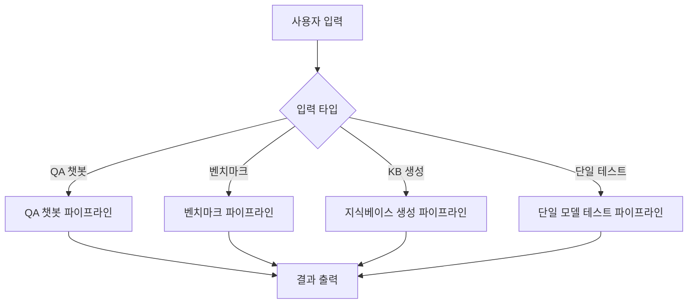

# NEO 벤치마크 시스템 상세 파이프라인 단계

## 🔄 전체 파이프라인 개요



---

## 🤖 QA 챗봇 파이프라인 (가장 복잡한 파이프라인)

### **1. 초기 시작 및 KB 존재 여부 검사**

- `run.py`에서 파이프라인 시작
- `run.py` 내부에서 NEO KB 파일(.kb)의 존재 여부를 검사
    - **Yes**: 다음 단계인 'Agent 대화 모드'로 즉시 이동
        - 이는 이미 KB와 관련 메타데이터가 생성되었다고 판단하여, KB 생성 단계를 생략
    - **No**: KB 생성 파이프라인으로 분기하여 KB 생성 후 진행

### **2. Agent 대화 모드 (정보 구조화)**

- `send_message()` 함수에서 Agent와 사용자 대화를 통한 정보 구조화
    - **Agent 시스템 프롬프트 구성**: 사용자와의 대화를 통해 정보를 체계적으로 정리
    - **동적 질문**: 정보가 부족할 경우 추가 질문을 통한 정보 수집
    - **구조화된 출력**: 충분한 정보 수집 후 구조화된 형태로 변환
    - **응답 분석**:
        - `"구조화완료:"`로 시작: 정보가 충분한 경우, 다음 단계로 진행
        - `"추가질문:"`으로 시작: 정보가 부족한 경우, 추가 질문 반환

### **3. RAG 검색 (벡터 검색)**

- `chroma_rag.py`에서 Chroma 벡터 데이터베이스를 통한 관련 지식 검색
    - **KB 파일 로드**: 선택된 KB 파일(.kb)에서 텍스트 추출
    - **임베딩 캐시 확인**: 중복 임베딩 방지를 위한 캐싱 메커니즘
    - **벡터 검색**: 사용자 질의와 유사한 KB 항목들을 top-k개 검색
    - **컨텍스트 구성**: 검색된 관련 지식들을 하나의 컨텍스트로 통합

### **4. NEO Query 변환 (자연어 → NEO)**

- `send_message()` 함수에서 자연어 질의를 NEO Query로 변환
    - **시스템 프롬프트 구성**: NEO 변환을 위한 특화된 프롬프트 생성
    - **RAG 컨텍스트 통합**: 검색된 관련 지식을 프롬프트에 포함
    - **LLM 변환**: GPT/Gemini/로컬 모델을 사용하여 자연어를 NEO Query로 변환
    - **출력 정제**: 변환된 NEO Query에서 불필요한 부분 제거

### **5. NEO Engine 실행 (논리적 추론)**

- `engine.py`에서 NEO Engine을 통한 논리적 추론 실행
    - **NEO Engine 초기화**: KB 파일 로드 및 엔진 준비
    - **쿼리 실행**: 변환된 NEO Query를 NEO Engine에 전달하여 실행
    - **결과 검증**: 실행 결과의 유효성 검사
    - **결과 반환**: 추론된 Fact 또는 nil 반환

### **6. 최종 응답 생성 (자연어 변환)**

- `send_message()` 함수에서 NEO Engine 결과를 자연어로 변환
    - **결과 검사**: NEO Engine 결과가 nil인지 확인
    - **시스템 프롬프트 구성**: KB 내용과 NEO Engine 결과를 포함한 최종 프롬프트 생성
    - **평가 모드 확인**: 출력 평가 및 재생성 기능 사용 여부 확인
        - **Yes**: `generate_with_retry()` 함수 사용
        - **No**: 일반 `generate()` 함수 사용
    - **자연어 응답 생성**: 최종 사용자 응답 생성

---

## 📊 벤치마크 파이프라인

### **1. 초기 설정 및 모델 준비**

- `run_benchmark_task()` 함수에서 벤치마크 시작
- **모델 선택**: 벤치마크에 사용할 모델들 선택 (GPT, Gemini, 로컬 모델)
- **질의 로드**: JSON 파일 또는 텍스트에서 벤치마크 질의 로드
- **카테고리 필터링**: 선택된 카테고리의 질의만 사용

### **2. 복합질의 단순화 (전처리)**

- `ollama_preprocessor.py`에서 복잡한 문장을 단순 문장들로 분리
    - **복합질의 단순화 적용**: `use_simplification` 플래그 확인
    - **LLM 기반 분리**: sLLM에 프롬프트 엔지니어링을 사용하여 복잡한 문장을 여러 개의 단순 문장으로 분리
    - **매핑 저장**: 원본 질의와 단순화된 질의들 간의 매핑 저장
    - **카테고리 매핑**: 단순화된 질의들에 대한 카테고리 정보 유지

### **3. 모델별 실행 및 결과 수집**

- 각 모델에 대해 순차적으로 실행
    - **모델 서버 시작**: 로컬 모델의 경우 llama.cpp 서버 시작
    - **질의별 실행**: 각 단순화된 질의에 대해 모델 실행
    - **평가 모드 확인**: 출력 평가 및 재생성 기능 사용 여부 확인
        - **Yes**: `generate_with_retry()` 함수 사용
        - **No**: 일반 `generate()` 함수 사용
    - **결과 수집**: 각 모델의 실행 결과와 메타데이터 수집

### **4. 성능 분석 및 시각화**

- `save_and_plot()` 함수에서 결과 분석
    - **성공률 계산**: 에러가 없는 응답의 비율 계산
    - **처리 시간 분석**: 평균 처리 시간 및 토큰/초 계산
    - **평가 점수 분석**: 평가 모드 사용 시 평균 평가 점수 계산
    - **결과 저장**: JSON 및 CSV 형태로 상세 결과 저장
    - **시각화**: 성능 지표를 그래프로 시각화

---

## 📚 지식베이스 생성 파이프라인

### **1. 입력 데이터 검사 및 전처리**

- `generate_knowledge_base()` 함수에서 KB 생성 시작
- **입력 타입 확인**: 텍스트 입력, 파일 업로드, URL 입력 중 선택
- **데이터 추출**:
    - **텍스트 입력**: 직접 입력된 텍스트 사용
    - **파일 업로드**: PDF, DOCX, TXT, MD 파일에서 텍스트 추출
    - **URL 입력**: 웹 페이지에서 텍스트 추출
- **PDF 분할 처리**: PDF 파일의 경우 페이지별 또는 청크별로 분할

### **2. LLM 기반 KB 변환**

- 선택된 모델을 사용하여 텍스트를 KB 형식으로 변환
    - **형식별 지침 구성**: NEO 형식(.kb), 자연어 형식(.nkb), JSON 형식(.json) 중 선택
    - **시스템 프롬프트 적용**: KB 생성을 위한 특화된 프롬프트 사용
    - **LLM 변환**: 텍스트를 선택된 형식의 KB로 변환
    - **PDF 분할 처리**: PDF의 경우 각 청크별로 변환 후 결과 통합

### **3. 결과 저장 및 후처리**

- 생성된 KB를 파일로 저장
    - **파일명 생성**: 사용자 지정 파일명 또는 기본 파일명 사용
    - **형식별 저장**: 선택된 출력 형식에 따라 적절한 확장자로 저장
    - **중복 제거**: 생성된 KB에서 중복 항목 제거
    - **정렬**: KB 항목들을 알파벳 순으로 정렬

---

## 🔄 평가 기반 재생성 시스템

### **1. 모델 생성 단계**

- `generate_with_retry()` 함수에서 모델 출력 생성
    - **시스템 프롬프트 적용**: 원본 시스템 프롬프트로 모델 실행
    - **출력 생성**: 선택된 모델을 사용하여 응답 생성
    - **에러 처리**: 모델 생성 중 오류 발생 시 즉시 반환

### **2. 출력 평가 단계**

- `evaluate_output()` 함수에서 생성된 출력 평가
    - **평가 기준 적용**: 정확성, 완성도, 명확성, 관련성 (각 0-10점)
    - **평가 모델 실행**: 별도의 평가 모델을 사용하여 출력 평가
    - **JSON 파싱**: 평가 결과를 JSON 형태로 파싱
    - **통과 기준**: 총점 30점 이상 시 통과, 미만 시 불통과

### **3. 재생성 루프**

- 평가 결과에 따른 재생성 결정
    - **통과**: 결과 반환 및 루프 종료
    - **불통과**: 재시도 횟수 확인
        - **재시도 가능**: 2초 대기 후 재생성
        - **최대 시도 도달**: 마지막 결과 반환 및 경고 메시지

---

## ⚡ 성능 최적화 메커니즘

### **1. 캐싱 시스템**

- **KB 임베딩 캐시**: `kb_embedding_cache`로 중복 임베딩 방지
- **모델 서버 재사용**: `LlamaServerManager`로 서버 상태 관리
- **시스템 프롬프트 캐시**: `system_prompts` 딕셔너리로 프롬프트 재사용

### **2. 병렬 처리**

- **모델별 병렬 실행**: 벤치마크에서 여러 모델 동시 실행 가능
- **질의별 병렬 처리**: 복합질의 단순화에서 병렬 처리 가능
- **배치 처리**: 여러 질의를 배치로 처리하여 효율성 향상

### **3. 에러 처리**

- **모듈별 독립적 에러 처리**: 각 모듈의 가용성에 따른 기능 비활성화
- **타임아웃 처리**: API 호출 시 타임아웃 설정으로 안정성 확보
- **재시도 메커니즘**: 평가 모드에서 응답 품질 향상을 위한 재시도

---

## 📊 성능 지표 및 모니터링

### **1. 처리 시간 분석**

| 파이프라인 | 평균 처리 시간 | 세부 내역 |
|------------|----------------|-----------|
| **QA 챗봇** | 5-10초 | Agent 대화(2-3초) + RAG(1-2초) + NEO Engine(1-2초) + 응답 생성(1-2초) |
| **벤치마크** | 모델당 2-5초 | 복합질의 단순화 포함 |
| **KB 생성** | 10초-5분 | 문서 크기에 따라 변동 |

### **2. 정확도 지표**

| 구성요소 | 정확도 | 설명 |
|----------|--------|------|
| **NEO Query 변환** | 85-90% | 자연어를 NEO 질의어로 변환하는 정확도 |
| **RAG 검색** | 80-85% | 벡터 검색을 통한 관련 지식 검색 정확도 |
| **NEO Engine 추론** | 90-95% | 논리적 추론을 통한 답변 생성 정확도 |
| **평가 기반 재생성** | +10-15% | 기존 대비 품질 향상률 |

### **3. 리소스 사용량**

| 리소스 | 사용량 | 세부사항 |
|--------|--------|----------|
| **메모리** | 모델별 2-8GB | 모델 크기에 따라 변동 |
| **GPU** | 4-16GB VRAM | 로컬 모델 사용 시 |
| **CPU** | 20-40% 증가 | 평가 시스템 사용 시 |

---

## 🔧 문제 해결 및 디버깅

### **1. 일반적인 문제들**

#### 모델 서버 연결 실패
```python
# 해결 방법
if not benchmark.server_manager.start(model_path, context_size, port, gpu_layers):
    print("서버 시작 실패. 포트 충돌 확인 필요")
    # 다른 포트로 재시도
```

#### 메모리 부족 오류
```python
# 해결 방법
# GPU 레이어 수 조정
gpu_layers = 50  # 100에서 50으로 감소
```

#### API 키 오류
```python
# 해결 방법
if not openai_api_key:
    print("OpenAI API 키가 필요합니다.")
    # API 키 설정 필요
```

### **2. 성능 최적화 팁**

#### 캐시 활용
- KB 임베딩 캐시 활성화
- 시스템 프롬프트 재사용
- 모델 서버 재사용

#### 병렬 처리
- 모델별 병렬 실행
- 질의별 병렬 처리
- 배치 처리 활용

#### 리소스 관리
- GPU 메모리 모니터링
- 메모리 사용량 최적화
- CPU 사용률 조정

---

## 🚀 확장 가능성

### **1. 새 모델 추가**
```python
# model_paths 딕셔너리에 새 모델 추가
model_paths = {
    "gpt-4o": "openai",
    "gemini-1.5-pro": "google",
    "new-model": "path/to/model.gguf"  # 새 모델 추가
}
```

### **2. 새 평가 방식 추가**
```python
# evaluate_output 함수 확장
def evaluate_output(prompt: str, output: str, model_name: str, ...):
    # 새로운 평가 기준 추가 가능
    evaluation_criteria = {
        "accuracy": "정확성 평가",
        "completeness": "완성도 평가",
        "clarity": "명확성 평가",
        "relevance": "관련성 평가",
        "new_criteria": "새로운 평가 기준"  # 추가 가능
    }
```

### **3. 새 출력 형식 추가**
```python
# KB 생성 시 새로운 형식 지원
format_instructions = {
    "NEO 형식 (.kb)": "NEO 엔진용 S-식 형태",
    "자연어 형식 (.nkb)": "자연어 형태",
    "JSON 형식 (.json)": "JSON 구조화 형태",
    "새로운 형식": "새로운 출력 형식"  # 추가 가능
}
```

---

*이 문서는 NEO 벤치마크 시스템의 상세 파이프라인 단계를 설명합니다. 각 단계는 독립적으로 실행되며, 모듈화된 설계로 유지보수와 확장이 용이합니다.* 