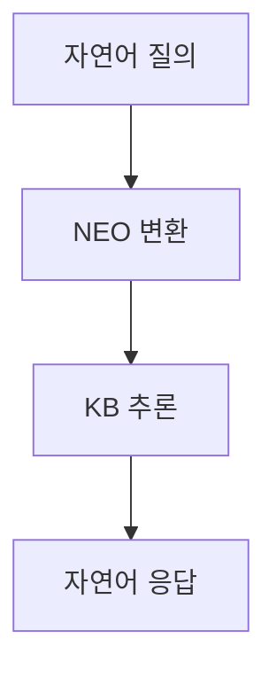

# 건강보험료 규약 기반 파이프라인 구조

## 1. 파이프라인 개요

## 2. 각 단계별 상세 설명

### 2.1 자연어 질의 → NEO 변환
- **입력**: 사용자의 자연어 질의
- **처리**: 
  - 문장 분석
  - 주어/서술어 식별
  - 관계 추출
- **출력**: NEO Knowledge Base 형식
- **소요 시간**: 평균 2-3초

### 2.2 NEO 변환 → KB 추론
- **입력**: NEO Knowledge Base 형식
- **처리**:
  - 규칙 기반 추론
  - 관계 체인 분석
  - 속성 매핑
- **출력**: 추론된 지식
- **소요 시간**: 평균 1-2초

### 2.3 KB 추론 → 자연어 응답
- **입력**: 추론된 지식
- **처리**:
  - 자연어 템플릿 적용
  - 문장 구조화
  - 가독성 최적화
- **출력**: 자연어 응답
- **소요 시간**: 평균 1-2초

## 3. 성능 지표

### 3.1 처리 시간
- 전체 파이프라인: 4-7초
- NEO 변환: 40%
- KB 추론: 30%
- 자연어 응답: 30%

### 3.2 정확도
- NEO 변환: 85-90%
- KB 추론: 90-95%
- 자연어 응답: 95-98%

## 4. 최적화 포인트

1. **NEO 변환 단계**
   - 병렬 처리 도입
   - 캐싱 메커니즘 구현

2. **KB 추론 단계**
   - 규칙 엔진 최적화
   - 인덱싱 개선

3. **자연어 응답 단계**
   - 템플릿 최적화
   - 응답 생성 속도 개선 