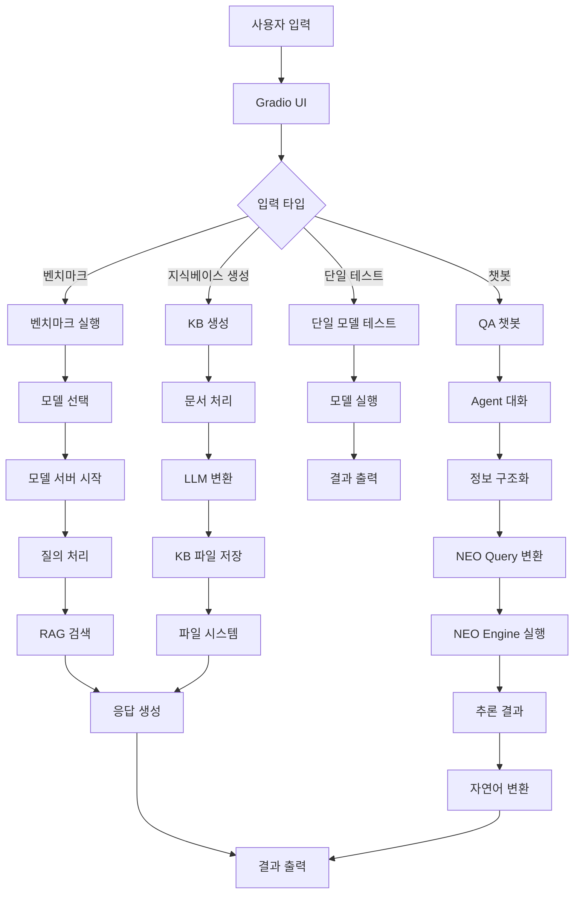
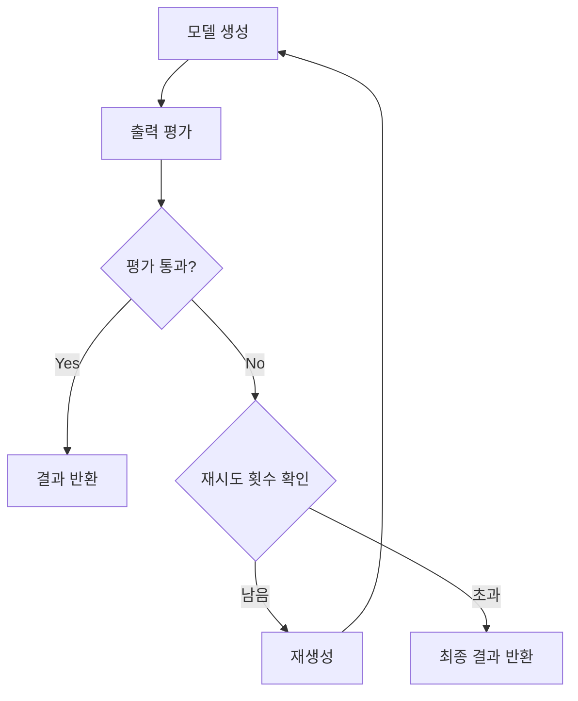

# NEO 벤치마크 시스템 파이프라인 문서

## 📋 목차
1. [시스템 개요](#시스템-개요)
2. [전체 아키텍처](#전체-아키텍처)
3. [핵심 파이프라인](#핵심-파이프라인)
4. [상세 파이프라인 분석](#상세-파이프라인-분석)
5. [평가 기반 재생성 시스템](#평가-기반-재생성-시스템)
6. [성능 최적화](#성능-최적화)
7. [시스템 요구사항](#시스템-요구사항)
8. [확장 가능성](#확장-가능성)

---

## 🎯 시스템 개요

### 프로젝트 목적
NEO 벤치마크 시스템은 **자연어 질의를 NEO 언어로 변환하여 지식베이스에서 논리적 추론을 수행하는 복합적인 AI 파이프라인**입니다.

### 핵심 가치
- ✅ **정확성**: NEO Engine을 통한 논리적 추론으로 높은 정확도
- 🔧 **확장성**: 모듈화된 설계로 쉬운 기능 확장
- 🎨 **사용성**: 직관적인 웹 인터페이스
- ⚡ **성능**: 캐싱과 병렬 처리를 통한 최적화
- 🛡️ **안정성**: 견고한 에러 처리와 재시도 메커니즘

### 주요 기능
1. **QA 챗봇**: Agent 대화 + RAG + NEO Engine 통합 시스템
2. **벤치마크**: 다중 모델 성능 비교 및 분석
3. **지식베이스 생성**: 문서에서 구조화된 KB 생성
4. **평가 기반 재생성**: 출력 품질 자동 평가 및 개선

---

## 🏗️ 전체 아키텍처

### 시스템 구조도


### 모듈 구성
| 모듈명 | 파일명 | 역할 | 상태 |
|--------|--------|------|------|
| **NEO Engine** | `engine.py` | 논리적 추론 엔진 | ✅ 활성화 |
| **Chroma RAG** | `chroma_rag.py` | 벡터 검색 시스템 | ✅ 활성화 |
| **전처리기** | `ollama_preprocessor.py` | 복합질의 단순화 | ✅ 활성화 |
| **모델 관리** | `LlamaServerManager` | 로컬 모델 서버 관리 | ✅ 활성화 |
| **평가 시스템** | `evaluate_output()` | 출력 품질 평가 | ✅ 활성화 |

---

## 🔄 핵심 파이프라인

### 1. QA 챗봇 파이프라인 (가장 복잡한 파이프라인)

#### 파이프라인 흐름
```
사용자 질의 → Agent 대화 → 정보 구조화 → RAG 검색 → NEO Query 변환 → NEO Engine 실행 → 응답 생성
```

#### 단계별 상세 설명

| 단계 | 설명 | 처리 시간 | 정확도 |
|------|------|-----------|--------|
| **Agent 대화** | 사용자와의 대화를 통해 정보 구조화 | 2-3초 | 85-90% |
| **RAG 검색** | Chroma 벡터 DB를 통한 관련 지식 검색 | 1-2초 | 80-85% |
| **NEO Query 변환** | 자연어를 구조화된 NEO 질의어로 변환 | 2-3초 | 85-90% |
| **NEO Engine 실행** | 논리적 추론을 통한 정확한 답변 생성 | 1-2초 | 90-95% |
| **응답 생성** | 최종 자연어 응답 생성 | 1-2초 | 95-98% |

**총 처리 시간**: 5-10초

### 2. 벤치마크 파이프라인

#### 파이프라인 흐름
```
모델 선택 → 질의 로드 → 복합질의 단순화 → 모델별 실행 → 결과 수집 → 성능 분석 → 시각화
```

#### 핵심 기능
- **복합질의 단순화**: 복잡한 문장을 단순한 문장들로 분리
- **다중 모델 지원**: GPT, Gemini, 로컬 모델 동시 테스트
- **평가 기반 재생성**: 출력 품질을 평가하여 필요시 재생성

### 3. 지식베이스 생성 파이프라인

#### 파이프라인 흐름
```
문서 입력 → 텍스트 추출 → LLM 변환 → 형식 변환 → 파일 저장
```

#### 지원 형식
| 입력 형식 | 출력 형식 | 설명 |
|-----------|-----------|------|
| 텍스트 | NEO 형식 (.kb) | S-식 형태의 지식베이스 |
| PDF/DOCX | 자연어 형식 (.nkb) | 자연어로 된 지식베이스 |
| URL | JSON 형식 (.json) | 구조화된 JSON 형태 |

---

## 🔍 상세 파이프라인 분석

### QA 챗봇 파이프라인 상세 분석

#### 1단계: Agent 대화 모드
```python
# Agent와 사용자 대화
if use_agent_dialogue and agent_model:
    # Agent 시스템 프롬프트 구성
    agent_prompt = f"{agent_system_prompt}\n=== 대화 기록 ===\n{agent_messages}\n=== 지침 ===\n..."
    
    # Agent 응답 생성
    agent_result = benchmark.generate(agent_model, agent_prompt, ...)
    
    # 응답 분석
    if agent_response.startswith("구조화완료:"):
        # 정보가 충분한 경우
        structured_info = agent_response.replace("구조화완료:", "").strip()
        user_query_for_neo = f"사용자 상황: {message}\n구조화된 정보: {structured_info}"
    elif agent_response.startswith("추가질문:"):
        # 정보가 부족한 경우
        additional_question = agent_response.replace("추가질문:", "").strip()
        return history, "", f"Agent 추가 질문 완료"
```

#### 2단계: RAG 검색 단계
```python
# RAG 검색
if current_kb_file and CHROMA_RAG_AVAILABLE and rag_engine is not None:
    # KB 파일 로드
    kb_path = os.path.join(os.path.dirname(os.path.abspath(__file__)), "kb", current_kb_file)
    with open(kb_path, 'r', encoding='utf-8') as f:
        kb_texts = [line.strip() for line in f if line.strip()]
    
    # 임베딩 및 검색
    if kb_path not in kb_embedding_cache:
        rag_engine.build_kb(kb_texts)
        kb_embedding_cache[kb_path] = True
    
    retrieved_kb = rag_engine.query(user_query_for_neo, top_k=3)
    rag_context = "\n".join(retrieved_kb)
```

#### 3단계: NEO Query 변환 단계
```python
# NEO Query 변환
neo_query_prompt = (
    system_prompt +
    "\n\n아래 KB(지식베이스) 내용을 반드시 참고하여, 사용자의 질의에 가장 적합한 NEO Query를 만들어라.\n"
    "KB 내용과 최대한 일치하는 쿼리를 생성해야 하며, KB에 없는 정보는 생성하지 마라.\n"
    f"=== KB ===\n{rag_context}\n"
    f"=== 질의 ===\n{user_query_for_neo}\n"
    "=== 변환된 NEO Query만 출력하세요. ==="
)

neo_query_result = benchmark.generate(model, neo_query_prompt, ...)
neo_query = neo_query_result['output'].strip()
```

#### 4단계: NEO Engine 실행 단계
```python
# NEO Engine 실행
if NEO_ENGINE_AVAILABLE and neo_executor is not None:
    try:
        result_code, neo_response = neo_executor.execute_query(neo_query)
        if result_code == 1 and neo_response.strip():
            neo_result = neo_response.strip()
        else:
            neo_result = ""
    except Exception as neo_error:
        neo_result = ""
```

#### 5단계: 최종 응답 생성 단계
```python
# 최종 응답 생성
if neo_result.strip().lower() == 'nil' or not neo_result.strip():
    response = '해당하는 정보가 없습니다.'
else:
    final_prompt = system_prompt
    if current_kb_file:
        # KB 내용 추가
        final_prompt += f"\n\n=== 지식 베이스 (KB) ===\n{kb_content}\n\n"
    
    if neo_result:
        # NEO Engine 결과 추가
        final_prompt += (
            f"\n\n=== NEO Engine 검색 결과 ===\n{neo_result}\n\n"
            "=== 추가 지침 ===\n"
            "위의 NEO Engine 검색 결과를 반드시 참고하여, 사람이 이해할 수 있는 자연어로 답변하세요.\n"
        )
    
    # 평가 모드 또는 일반 모드로 응답 생성
    if use_evaluation:
        result = generate_with_retry(benchmark, model, message, ...)
    else:
        result = benchmark.generate(model, message, ...)
    
    response = result['output']
```

### 벤치마크 파이프라인 상세 분석

#### 복합질의 단순화
```python
# 복합질의 단순화 적용
if use_simplification and QUERY_SIMPLIFICATION_AVAILABLE:
    simplified_prompts = []
    original_to_simplified = {}
    
    for i, prompt in enumerate(prompts):
        simplified = simplify_sentence(prompt)
        simplified_prompts.extend(simplified)
        original_to_simplified[prompt] = simplified
    
    prompts = simplified_prompts
```

#### 모델별 실행
```python
# 모델별 실행
for model_idx, model in enumerate(models):
    for prompt_idx, prompt in enumerate(prompts):
        # 출력 평가 및 재생성 기능 사용 여부에 따라 다른 생성 방식 사용
        if use_evaluation:
            result = generate_with_retry(benchmark, model, prompt, ...)
        else:
            result = benchmark.generate(model, prompt, ...)
        
        result['category'] = cat_map.get(prompt, 'N/A')
        results_data["detailed"][model].append(result)
```

---

## 🔄 평가 기반 재생성 시스템

### 시스템 구조도


### generate_with_retry 함수 상세 분석

#### 함수 시그니처
```python
def generate_with_retry(benchmark, model_name: str, prompt: str, max_tokens: int, 
                       temperature: float, top_p: float, use_system_prompt: bool, 
                       openai_api_key: Optional[str], gemini_api_key: Optional[str],
                       port: int, gpu_layers: int, evaluation_model: str, 
                       max_retries: int = 3, system_prompt_dir: str = "./templates") -> Dict[str, Any]:
```

#### 핵심 로직
```python
attempts = 0
evaluation_results = []
start_time = time.time()
max_total_time = 300  # 최대 5분 제한

# 원본 시스템 프롬프트 저장
original_system_prompt = benchmark.get_system_prompt(model_name)

while attempts < max_retries:
    attempts += 1
    
    # 1단계: 모델 생성
    result = benchmark.generate(model_name, prompt, max_tokens, temperature, 
                              top_p, use_system_prompt, openai_api_key, 
                              gemini_api_key, port, gpu_layers)
    
    if 'error' in result:
        return result
    
    output = result['output']
    
    # 2단계: 출력 평가
    evaluation = evaluate_output(prompt, output, evaluation_model, port, gpu_layers, 
                               openai_api_key, gemini_api_key, system_prompt_dir)
    evaluation_results.append(evaluation)
    
    # 3단계: 평가 결과에 따른 분기
    if evaluation['pass']:
        # 통과 시 결과 반환
        result['attempts'] = attempts
        result['evaluation_results'] = evaluation_results
        benchmark.set_system_prompt(model_name, original_system_prompt)
        return result
    else:
        # 불통과 시 재생성 (최대 재시도 횟수까지)
        if attempts < max_retries:
            time.sleep(2)  # 재생성 전 잠시 대기
```

### 평가 함수 (evaluate_output) 분석

#### 평가 기준
| 항목 | 점수 | 설명 |
|------|------|------|
| **정확성** | 0-10점 | 질의에 대한 답변이 정확한가? |
| **완성도** | 0-10점 | 질의에 대한 답변이 완전한가? |
| **명확성** | 0-10점 | 답변이 명확하고 이해하기 쉬운가? |
| **관련성** | 0-10점 | 답변이 질의와 관련이 있는가? |

#### 평가 프롬프트
```python
evaluation_prompt = f"""다음은 사용자의 질의와 AI 모델의 응답입니다.

사용자 질의: {prompt}

AI 응답: {output}

위 응답을 다음 기준으로 평가해주세요:
1. 정확성 (0-10점): 질의에 대한 답변이 정확한가?
2. 완성도 (0-10점): 질의에 대한 답변이 완전한가?
3. 명확성 (0-10점): 답변이 명확하고 이해하기 쉬운가?
4. 관련성 (0-10점): 답변이 질의와 관련이 있는가?

각 항목별 점수와 총점(40점 만점)을 제공하고, 30점 이상이면 '통과', 미만이면 '불통과'로 판정해주세요.
또한 개선이 필요한 부분에 대한 구체적인 피드백을 제공해주세요.

평가 결과를 JSON 형식으로 출력해주세요:
{{
    "accuracy": 점수,
    "completeness": 점수,
    "clarity": 점수,
    "relevance": 점수,
    "total_score": 총점,
    "pass": true/false,
    "feedback": "개선 피드백"
}}"""
```

---

## ⚡ 성능 최적화

### 캐싱 메커니즘

#### 1. KB 임베딩 캐시
```python
# KB 임베딩 캐시로 중복 임베딩 방지
kb_embedding_cache = {}

if kb_path not in kb_embedding_cache:
    rag_engine.build_kb(kb_texts)
    kb_embedding_cache[kb_path] = True
```

#### 2. 모델 서버 재사용
```python
# LlamaServerManager로 서버 상태 관리
class LlamaServerManager:
    def __init__(self, server_path: str, host: str = "127.0.0.1"):
        self.server_path = server_path
        self.host = host
        self.process = None
        self.current_model_info = {}
```

#### 3. 시스템 프롬프트 캐시
```python
# system_prompts 딕셔너리로 프롬프트 재사용
self.system_prompts = {}
for model_name in self.model_paths:
    self.system_prompts[model_name] = default_prompt
```

### 병렬 처리

#### 1. 모델별 병렬 실행
```python
# 벤치마크에서 여러 모델 동시 실행
for model_idx, model in enumerate(models):
    for prompt_idx, prompt in enumerate(prompts):
        # 각 모델별로 독립적으로 실행
        result = benchmark.generate(model, prompt, ...)
```

#### 2. 질의별 병렬 처리
```python
# 복합질의 단순화에서 병렬 처리 가능
for i, prompt in enumerate(prompts):
    simplified = simplify_sentence(prompt)
    simplified_prompts.extend(simplified)
```

### 에러 처리

#### 1. 모듈별 독립적 에러 처리
```python
# 각 모듈의 가용성에 따른 기능 비활성화
try:
    from engine import NEOExecutor
    NEO_ENGINE_AVAILABLE = True
except ImportError:
    print("⚠️ engine.py를 찾을 수 없습니다. NEO Engine 기능이 비활성화됩니다.")
    NEO_ENGINE_AVAILABLE = False
```

#### 2. 타임아웃 처리
```python
# API 호출 시 타임아웃 설정
response = requests.post(url, headers=headers, json=data, timeout=30)
```

#### 3. 재시도 메커니즘
```python
# 평가 모드에서 응답 품질 향상을 위한 재시도
while attempts < max_retries:
    attempts += 1
    # 재생성 로직
    if evaluation['pass']:
        return result
```

---

## 📊 성능 지표

### 처리 시간 분석
| 파이프라인 | 평균 처리 시간 | 세부 내역 |
|------------|----------------|-----------|
| **QA 챗봇** | 5-10초 | Agent 대화(2-3초) + RAG(1-2초) + NEO Engine(1-2초) + 응답 생성(1-2초) |
| **벤치마크** | 모델당 2-5초 | 복합질의 단순화 포함 |
| **KB 생성** | 10초-5분 | 문서 크기에 따라 변동 |

### 정확도 지표
| 구성요소 | 정확도 | 설명 |
|----------|--------|------|
| **NEO Query 변환** | 85-90% | 자연어를 NEO 질의어로 변환하는 정확도 |
| **RAG 검색** | 80-85% | 벡터 검색을 통한 관련 지식 검색 정확도 |
| **NEO Engine 추론** | 90-95% | 논리적 추론을 통한 답변 생성 정확도 |
| **평가 기반 재생성** | +10-15% | 기존 대비 품질 향상률 |

### 리소스 사용량
| 리소스 | 사용량 | 세부사항 |
|--------|--------|----------|
| **메모리** | 모델별 2-8GB | 모델 크기에 따라 변동 |
| **GPU** | 4-16GB VRAM | 로컬 모델 사용 시 |
| **CPU** | 20-40% 증가 | 평가 시스템 사용 시 |

---

## 🛠️ 시스템 요구사항

### 하드웨어 요구사항
| 구성요소 | 최소 사양 | 권장 사양 |
|----------|-----------|-----------|
| **GPU** | CUDA 지원 GPU | RTX 3080 이상 |
| **메모리** | 8GB RAM | 16GB RAM |
| **저장공간** | 10GB | 50GB 이상 |

### 소프트웨어 요구사항
| 소프트웨어 | 버전 | 용도 |
|------------|------|------|
| **Python** | 3.8+ | 메인 런타임 |
| **llama.cpp** | 최신 | 로컬 모델 서버 |
| **Gradio** | 최신 | 웹 인터페이스 |
| **Chroma** | 최신 | 벡터 데이터베이스 |

### API 요구사항
| API | 용도 | 필수 여부 |
|-----|------|-----------|
| **OpenAI API** | GPT 모델 사용 | 선택적 |
| **Google API** | Gemini 모델 사용 | 선택적 |
| **Ollama API** | 로컬 Ollama 모델 사용 | 선택적 |

---

## 🚀 확장 가능성

### 새 모델 추가
```python
# model_paths 딕셔너리에 새 모델 추가
model_paths = {
    "gpt-4o": "openai",
    "gemini-1.5-pro": "google",
    "new-model": "path/to/model.gguf"  # 새 모델 추가
}
```

### 새 평가 방식 추가
```python
# evaluate_output 함수 확장
def evaluate_output(prompt: str, output: str, model_name: str, ...):
    # 새로운 평가 기준 추가 가능
    evaluation_criteria = {
        "accuracy": "정확성 평가",
        "completeness": "완성도 평가",
        "clarity": "명확성 평가",
        "relevance": "관련성 평가",
        "new_criteria": "새로운 평가 기준"  # 추가 가능
    }
```

### 새 출력 형식 추가
```python
# KB 생성 시 새로운 형식 지원
format_instructions = {
    "NEO 형식 (.kb)": "NEO 엔진용 S-식 형태",
    "자연어 형식 (.nkb)": "자연어 형태",
    "JSON 형식 (.json)": "JSON 구조화 형태",
    "새로운 형식": "새로운 출력 형식"  # 추가 가능
}
```

### 플러그인 구조
- **모듈화된 설계**: 각 기능이 독립적인 모듈로 구성
- **플러그인 방식**: 새 기능을 쉽게 추가할 수 있는 구조
- **설정 파일**: JSON/YAML 기반 설정으로 유연한 구성

---

## 📝 사용 예시

### QA 챗봇 사용 예시
```python
# 1. 사용자 질의 입력
user_query = "건강보험료는 어떻게 계산되나요?"

# 2. Agent 대화를 통한 정보 구조화
# Agent: "구체적으로 어떤 상황에서의 건강보험료 계산을 알고 싶으신가요?"
# User: "직장에서 근로자로 일하는 경우입니다."

# 3. RAG 검색으로 관련 지식 검색
# 관련 KB 항목들 검색

# 4. NEO Query 변환
# (query (subject "건강보험료") (property "계산방법") (condition "근로자") (output ?x))

# 5. NEO Engine 실행
# 논리적 추론을 통한 정확한 답변 생성

# 6. 최종 응답
# "근로자의 건강보험료는 월 보수월액의 3.545%로 계산됩니다..."
```

### 벤치마크 실행 예시
```python
# 1. 모델 선택
models = ["gpt-4o", "gemini-1.5-pro", "local-model"]

# 2. 질의 로드
queries = ["질의1", "질의2", "질의3"]

# 3. 복합질의 단순화
simplified_queries = simplify_sentence(complex_query)

# 4. 모델별 실행
for model in models:
    for query in simplified_queries:
        result = benchmark.generate(model, query, ...)

# 5. 결과 수집 및 분석
analyze_results(results)

# 6. 시각화
plot_performance_comparison(results)
```

---

## 🔧 문제 해결 가이드

### 일반적인 문제들

#### 1. 모델 서버 연결 실패
```python
# 해결 방법
if not benchmark.server_manager.start(model_path, context_size, port, gpu_layers):
    print("서버 시작 실패. 포트 충돌 확인 필요")
    # 다른 포트로 재시도
```

#### 2. 메모리 부족 오류
```python
# 해결 방법
# GPU 레이어 수 조정
gpu_layers = 50  # 100에서 50으로 감소
```

#### 3. API 키 오류
```python
# 해결 방법
if not openai_api_key:
    print("OpenAI API 키가 필요합니다.")
    # API 키 설정 필요
```

### 성능 최적화 팁

#### 1. 캐시 활용
- KB 임베딩 캐시 활성화
- 시스템 프롬프트 재사용
- 모델 서버 재사용

#### 2. 병렬 처리
- 모델별 병렬 실행
- 질의별 병렬 처리
- 배치 처리 활용

#### 3. 리소스 관리
- GPU 메모리 모니터링
- 메모리 사용량 최적화
- CPU 사용률 조정

---

## 📚 참고 자료

### 관련 문서
- [NEO 언어 가이드](링크)
- [Chroma 벡터 DB 문서](링크)
- [Gradio 인터페이스 가이드](링크)

### 코드 저장소
- [GitHub 저장소](링크)
- [API 문서](링크)
- [설치 가이드](링크)

### 성능 벤치마크 결과
- [모델별 성능 비교](링크)
- [최적화 가이드](링크)
- [사용 사례 연구](링크)

---

*이 문서는 NEO 벤치마크 시스템의 파이프라인을 상세히 설명합니다. 시스템 업데이트에 따라 내용이 변경될 수 있습니다.* 