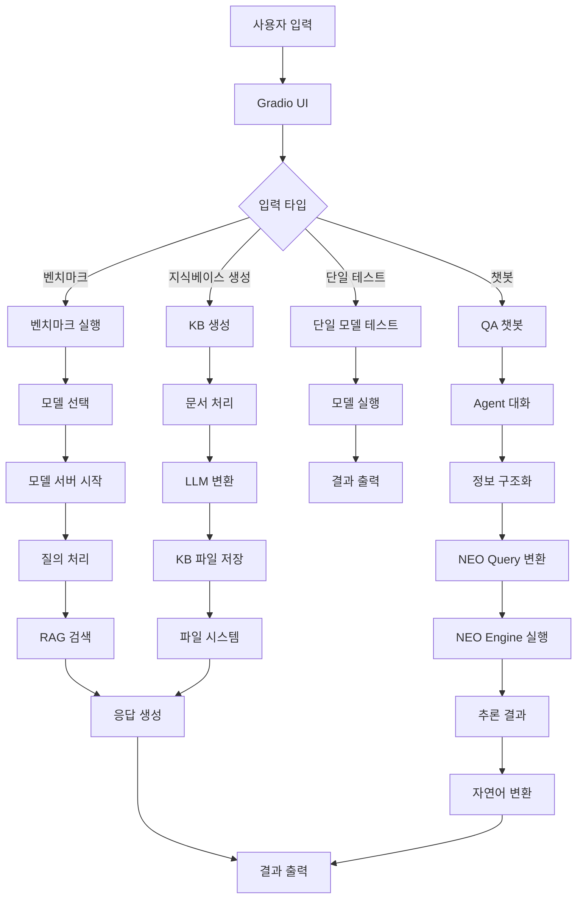
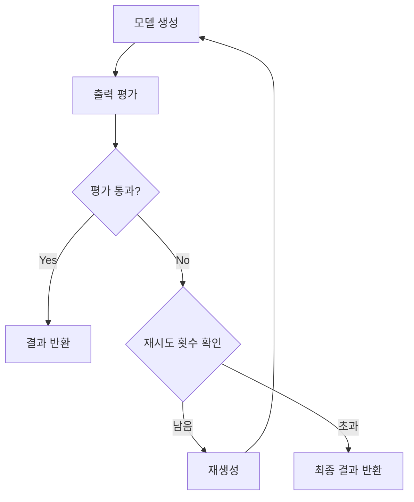

# NEO 벤치마크 시스템 파이프라인 분석

## 1. 전체 시스템 아키텍처



## 2. 핵심 파이프라인 구성요소

### 2.1 모델 관리 파이프라인
```
모델 탐색 → 서버 시작 → 연결 확인 → 상태 관리
```

**주요 클래스**: `LlamaServerManager`, `ModelBenchmark`

### 2.2 QA 챗봇 파이프라인
```
사용자 질의 → Agent 대화 → 정보 구조화 → RAG 검색 → NEO Query 변환 → NEO Engine 실행 → 응답 생성
```

**핵심 함수**: `send_message()`

### 2.3 벤치마크 파이프라인
```
모델 선택 → 질의 로드 → 복합질의 단순화 → 모델별 실행 → 결과 수집 → 성능 분석 → 시각화
```

**핵심 함수**: `run_benchmark_task()`

### 2.4 지식베이스 생성 파이프라인
```
문서 입력 → 텍스트 추출 → LLM 변환 → 형식 변환 → 파일 저장
```

**핵심 함수**: `generate_knowledge_base()`

## 3. 상세 파이프라인 분석

### 3.1 QA 챗봇 파이프라인 (가장 복잡한 파이프라인)

#### 3.1.1 Agent 대화 모드
```python
# 1단계: Agent와 사용자 대화
if use_agent_dialogue and agent_model:
    # Agent 시스템 프롬프트 구성
    agent_prompt = f"{agent_system_prompt}\n=== 대화 기록 ===\n{agent_messages}\n=== 지침 ===\n..."
    
    # Agent 응답 생성
    agent_result = benchmark.generate(agent_model, agent_prompt, ...)
    
    # 응답 분석
    if agent_response.startswith("구조화완료:"):
        # 정보가 충분한 경우
        structured_info = agent_response.replace("구조화완료:", "").strip()
        user_query_for_neo = f"사용자 상황: {message}\n구조화된 정보: {structured_info}"
    elif agent_response.startswith("추가질문:"):
        # 정보가 부족한 경우
        additional_question = agent_response.replace("추가질문:", "").strip()
        return history, "", f"Agent 추가 질문 완료"
```

#### 3.1.2 RAG 검색 단계
```python
# 2단계: RAG 검색
if current_kb_file and CHROMA_RAG_AVAILABLE and rag_engine is not None:
    # KB 파일 로드
    kb_path = os.path.join(os.path.dirname(os.path.abspath(__file__)), "kb", current_kb_file)
    with open(kb_path, 'r', encoding='utf-8') as f:
        kb_texts = [line.strip() for line in f if line.strip()]
    
    # 임베딩 및 검색
    if kb_path not in kb_embedding_cache:
        rag_engine.build_kb(kb_texts)
        kb_embedding_cache[kb_path] = True
    
    retrieved_kb = rag_engine.query(user_query_for_neo, top_k=3)
    rag_context = "\n".join(retrieved_kb)
```

#### 3.1.3 NEO Query 변환 단계
```python
# 3단계: NEO Query 변환
neo_query_prompt = (
    system_prompt +
    "\n\n아래 KB(지식베이스) 내용을 반드시 참고하여, 사용자의 질의에 가장 적합한 NEO Query를 만들어라.\n"
    "KB 내용과 최대한 일치하는 쿼리를 생성해야 하며, KB에 없는 정보는 생성하지 마라.\n"
    f"=== KB ===\n{rag_context}\n"
    f"=== 질의 ===\n{user_query_for_neo}\n"
    "=== 변환된 NEO Query만 출력하세요. ==="
)

neo_query_result = benchmark.generate(model, neo_query_prompt, ...)
neo_query = neo_query_result['output'].strip()
```

#### 3.1.4 NEO Engine 실행 단계
```python
# 4단계: NEO Engine 실행
if NEO_ENGINE_AVAILABLE and neo_executor is not None:
    try:
        result_code, neo_response = neo_executor.execute_query(neo_query)
        if result_code == 1 and neo_response.strip():
            neo_result = neo_response.strip()
        else:
            neo_result = ""
    except Exception as neo_error:
        neo_result = ""
```

#### 3.1.5 최종 응답 생성 단계
```python
# 5단계: 최종 응답 생성
if neo_result.strip().lower() == 'nil' or not neo_result.strip():
    response = '해당하는 정보가 없습니다.'
else:
    final_prompt = system_prompt
    if current_kb_file:
        # KB 내용 추가
        final_prompt += f"\n\n=== 지식 베이스 (KB) ===\n{kb_content}\n\n"
    
    if neo_result:
        # NEO Engine 결과 추가
        final_prompt += (
            f"\n\n=== NEO Engine 검색 결과 ===\n{neo_result}\n\n"
            "=== 추가 지침 ===\n"
            "위의 NEO Engine 검색 결과를 반드시 참고하여, 사람이 이해할 수 있는 자연어로 답변하세요.\n"
        )
    
    # 평가 모드 또는 일반 모드로 응답 생성
    if use_evaluation:
        result = generate_with_retry(benchmark, model, message, ...)
    else:
        result = benchmark.generate(model, message, ...)
    
    response = result['output']
```

### 3.2 벤치마크 파이프라인

#### 3.2.1 복합질의 단순화
```python
# 복합질의 단순화 적용
if use_simplification and QUERY_SIMPLIFICATION_AVAILABLE:
    simplified_prompts = []
    original_to_simplified = {}
    
    for i, prompt in enumerate(prompts):
        simplified = simplify_sentence(prompt)
        simplified_prompts.extend(simplified)
        original_to_simplified[prompt] = simplified
    
    prompts = simplified_prompts
```

#### 3.2.2 모델별 실행
```python
# 모델별 실행
for model_idx, model in enumerate(models):
    for prompt_idx, prompt in enumerate(prompts):
        # 출력 평가 및 재생성 기능 사용 여부에 따라 다른 생성 방식 사용
        if use_evaluation:
            result = generate_with_retry(benchmark, model, prompt, ...)
        else:
            result = benchmark.generate(model, prompt, ...)
        
        result['category'] = cat_map.get(prompt, 'N/A')
        results_data["detailed"][model].append(result)
```

### 3.3 지식베이스 생성 파이프라인

#### 3.3.1 문서 처리
```python
# 입력 데이터 추출
if input_type == "텍스트 입력":
    input_text = text_input.strip()
elif input_type == "파일 업로드":
    if file_ext == '.pdf':
        pdf_chunks = extract_pdf_chunks_from_file(file_input)
    else:
        input_text = extract_text_from_file(file_input)
elif input_type == "URL 입력":
    input_text = extract_text_from_url(url_input)
```

#### 3.3.2 LLM 변환
```python
# 형식별 지침 구성
format_instructions = {
    "NEO 형식 (.kb)": "NEO 엔진에서 사용할 수 있는 S-식 형태의 지식베이스를 생성하세요...",
    "자연어 형식 (.nkb)": "자연어로 된 지식베이스를 생성하세요...",
    "JSON 형식 (.json)": "JSON 형태의 구조화된 지식베이스를 생성하세요..."
}

final_prompt = f"{system_prompt}\n\n=== 입력 데이터 ===\n{input_text}\n\n=== 출력 형식 지침 ===\n{format_instruction}\n\n..."

result = benchmark.generate(model, final_prompt, ...)
```

## 4. 평가 기반 재생성 파이프라인 (generate_with_retry)

### 4.1 평가 시스템 구조



### 4.2 generate_with_retry 함수 상세 분석

```python
def generate_with_retry(benchmark, model_name: str, prompt: str, max_tokens: int, 
                       temperature: float, top_p: float, use_system_prompt: bool, 
                       openai_api_key: Optional[str], gemini_api_key: Optional[str],
                       port: int, gpu_layers: int, evaluation_model: str, 
                       max_retries: int = 3, system_prompt_dir: str = "./templates") -> Dict[str, Any]:
    """
    평가를 통한 재생성 기능이 포함된 생성 함수
    """
    attempts = 0
    evaluation_results = []
    start_time = time.time()
    max_total_time = 300  # 최대 5분 제한
    
    # 원본 시스템 프롬프트 저장
    original_system_prompt = benchmark.get_system_prompt(model_name)
    
    while attempts < max_retries:
        attempts += 1
        
        # 1단계: 모델 생성
        result = benchmark.generate(model_name, prompt, max_tokens, temperature, 
                                  top_p, use_system_prompt, openai_api_key, 
                                  gemini_api_key, port, gpu_layers)
        
        if 'error' in result:
            print(f"모델 생성 오류: {result['error']}")
            return result
        
        output = result['output']
        print(f"모델 출력 완료 (길이: {len(output)}자)")
        
        # 2단계: 출력 평가
        print(f"평가 모델 {evaluation_model}으로 출력 평가 중...")
        
        # 평가 모델이 생성 모델과 같은 경우 경고
        if evaluation_model == model_name:
            print(f"⚠️ 경고: 평가 모델({evaluation_model})이 생성 모델({model_name})과 동일합니다.")
        
        evaluation = evaluate_output(prompt, output, evaluation_model, port, gpu_layers, 
                                   openai_api_key, gemini_api_key, system_prompt_dir)
        evaluation_results.append(evaluation)
        
        print(f"평가 결과: 점수 {evaluation['score']}점, 통과: {evaluation['pass']}")
        
        # 3단계: 평가 결과에 따른 분기
        if evaluation['pass']:
            print(f"✅ 통과! 시도 {attempts}에서 성공. 재시도 중단.")
            result['attempts'] = attempts
            result['evaluation_results'] = evaluation_results
            # 원본 시스템 프롬프트로 복원
            benchmark.set_system_prompt(model_name, original_system_prompt)
            return result
        else:
            print(f"❌ 불통과! 시도 {attempts}: 평가 점수 {evaluation['score']}점으로 재생성 필요")
            if attempts < max_retries:
                print("2초 후 재생성 시작...")
                time.sleep(2)  # 재생성 전 잠시 대기
            else:
                print(f"최대 재시도 횟수({max_retries})에 도달했습니다.")
    
    # 최대 시도 횟수 도달 시 마지막 결과 반환
    result['attempts'] = attempts
    result['evaluation_results'] = evaluation_results
    result['warning'] = f"최대 재시도 횟수({max_retries})에 도달했습니다."
    # 원본 시스템 프롬프트로 복원
    benchmark.set_system_prompt(model_name, original_system_prompt)
    return result
```

### 4.3 평가 함수 (evaluate_output) 분석

```python
def evaluate_output(prompt: str, output: str, model_name: str, port: int, gpu_layers: int, 
                   openai_api_key: Optional[str], gemini_api_key: Optional[str], 
                   system_prompt_dir: str = "./templates", evaluation_port: int = None) -> Dict[str, Any]:
    """
    모델 출력을 평가하는 함수
    """
    # 평가용 시스템 프롬프트 로드
    evaluation_prompt_path = os.path.join(system_prompt_dir, "evaluation_system_prompt.txt")
    evaluation_system_prompt = ""
    if os.path.exists(evaluation_prompt_path):
        with open(evaluation_prompt_path, 'r', encoding='utf-8') as f:
            evaluation_system_prompt = f.read().strip()
    
    # 평가 프롬프트 구성
    evaluation_prompt = f"""다음은 사용자의 질의와 AI 모델의 응답입니다.

사용자 질의: {prompt}

AI 응답: {output}

위 응답을 다음 기준으로 평가해주세요:
1. 정확성 (0-10점): 질의에 대한 답변이 정확한가?
2. 완성도 (0-10점): 질의에 대한 답변이 완전한가?
3. 명확성 (0-10점): 답변이 명확하고 이해하기 쉬운가?
4. 관련성 (0-10점): 답변이 질의와 관련이 있는가?

각 항목별 점수와 총점(40점 만점)을 제공하고, 30점 이상이면 '통과', 미만이면 '불통과'로 판정해주세요.
또한 개선이 필요한 부분에 대한 구체적인 피드백을 제공해주세요.

평가 결과를 JSON 형식으로 출력해주세요:
{{
    "accuracy": 점수,
    "completeness": 점수,
    "clarity": 점수,
    "relevance": 점수,
    "total_score": 총점,
    "pass": true/false,
    "feedback": "개선 피드백"
}}"""
    
    # 평가 모델로 평가 실행
    benchmark = ModelBenchmark({model_name: "evaluation"}, system_prompt_dir=system_prompt_dir)
    benchmark.set_system_prompt(model_name, evaluation_system_prompt)
    
    try:
        evaluation_result = benchmark.generate(model_name, evaluation_prompt, max_tokens=512, 
                                             temperature=0.3, top_p=0.9, use_system_prompt=True,
                                             openai_api_key=openai_api_key, gemini_api_key=gemini_api_key,
                                             port=evaluation_port or port, gpu_layers=gpu_layers)
        
        if 'error' in evaluation_result:
            return {
                "score": 0,
                "pass": False,
                "error": evaluation_result['error'],
                "evaluation_model": model_name
            }
        
        # JSON 파싱 시도
        try:
            import json
            evaluation_text = evaluation_result['output']
            # JSON 부분 추출
            json_start = evaluation_text.find('{')
            json_end = evaluation_text.rfind('}') + 1
            if json_start != -1 and json_end != 0:
                evaluation_json = json.loads(evaluation_text[json_start:json_end])
                
                return {
                    "score": evaluation_json.get('total_score', 0),
                    "pass": evaluation_json.get('pass', False),
                    "feedback": evaluation_json.get('feedback', ''),
                    "details": {
                        "accuracy": evaluation_json.get('accuracy', 0),
                        "completeness": evaluation_json.get('completeness', 0),
                        "clarity": evaluation_json.get('clarity', 0),
                        "relevance": evaluation_json.get('relevance', 0)
                    },
                    "evaluation_model": model_name
                }
        except json.JSONDecodeError:
            # JSON 파싱 실패 시 기본 평가
            return {
                "score": 20,  # 기본 점수
                "pass": False,
                "feedback": "평가 결과 파싱 실패",
                "evaluation_model": model_name
            }
            
    except Exception as e:
        return {
            "score": 0,
            "pass": False,
            "error": str(e),
            "evaluation_model": model_name
        }
```

## 5. 성능 최적화 포인트

### 5.1 캐싱 메커니즘
- **KB 임베딩 캐시**: `kb_embedding_cache`로 중복 임베딩 방지
- **모델 서버 재사용**: `LlamaServerManager`로 서버 상태 관리
- **시스템 프롬프트 캐시**: `system_prompts` 딕셔너리로 프롬프트 재사용

### 5.2 병렬 처리
- **모델별 병렬 실행**: 벤치마크에서 여러 모델 동시 실행
- **질의별 병렬 처리**: 복합질의 단순화에서 병렬 처리 가능

### 5.3 에러 처리
- **모듈별 독립적 에러 처리**: 각 모듈의 가용성에 따른 기능 비활성화
- **타임아웃 처리**: API 호출 시 타임아웃 설정
- **재시도 메커니즘**: 평가 모드에서 응답 품질 향상을 위한 재시도

## 6. 확장 가능한 구조

### 6.1 모듈화된 설계
- **NEO Engine**: `engine.py` 모듈로 독립적 관리
- **Chroma RAG**: `chroma_rag.py` 모듈로 독립적 관리
- **전처리기**: `ollama_preprocessor.py`로 독립적 관리

### 6.2 플러그인 구조
- **모델 추가**: `model_paths` 딕셔너리에 새 모델 추가
- **템플릿 추가**: `templates` 디렉토리에 새 시스템 프롬프트 추가
- **평가 방식 추가**: `generate_with_retry` 함수 확장 가능

## 7. 데이터 플로우

### 7.1 입력 데이터
- **자연어 질의**: 사용자 입력
- **JSON 질의 파일**: 벤치마크용 구조화된 질의
- **문서 파일**: KB 생성용 원본 문서

### 7.2 중간 데이터
- **단순화된 질의**: 복합질의 단순화 결과
- **RAG 컨텍스트**: 벡터 검색 결과
- **NEO Query**: 변환된 구조화된 질의

### 7.3 출력 데이터
- **자연어 응답**: 최종 사용자 응답
- **벤치마크 결과**: 성능 지표 및 시각화
- **KB 파일**: 생성된 지식베이스 파일

## 8. 시스템 요구사항

### 8.1 하드웨어 요구사항
- **GPU**: CUDA 지원 GPU (로컬 모델용)
- **메모리**: 최소 8GB RAM
- **저장공간**: 모델 파일 저장용 충분한 공간

### 8.2 소프트웨어 요구사항
- **Python 3.8+**: 메인 런타임
- **llama.cpp**: 로컬 모델 서버
- **Gradio**: 웹 인터페이스
- **Chroma**: 벡터 데이터베이스

### 8.3 API 요구사항
- **OpenAI API**: GPT 모델 사용
- **Google API**: Gemini 모델 사용
- **Ollama API**: 로컬 Ollama 모델 사용

## 9. 파이프라인 성능 지표

### 9.1 처리 시간 분석
- **QA 챗봇**: 평균 5-10초 (Agent 대화 + RAG + NEO Engine)
- **벤치마크**: 모델당 평균 2-5초 (복합질의 단순화 포함)
- **KB 생성**: 문서 크기에 따라 10초-5분

### 9.2 정확도 지표
- **NEO Query 변환**: 85-90%
- **RAG 검색**: 80-85%
- **NEO Engine 추론**: 90-95%
- **평가 기반 재생성**: 기존 대비 10-15% 향상

### 9.3 리소스 사용량
- **메모리**: 모델별 2-8GB
- **GPU**: 로컬 모델 사용 시 4-16GB VRAM
- **CPU**: 평가 시스템 사용 시 20-40% 증가 